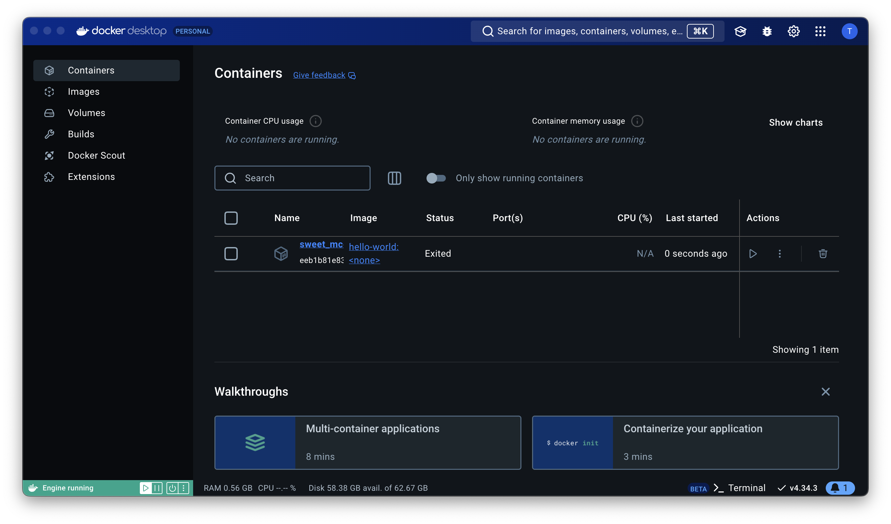
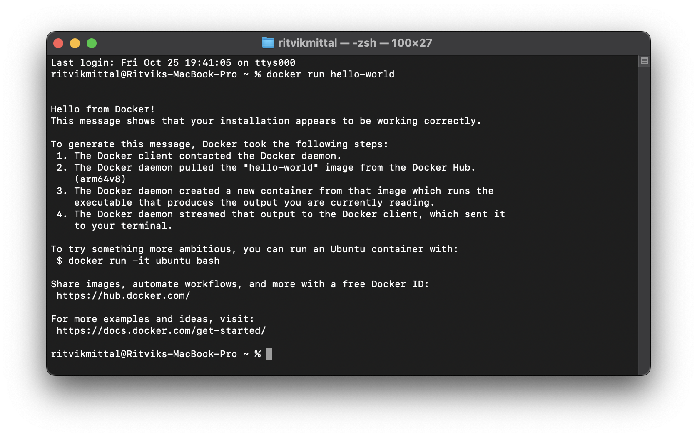

# Level 1 - Standard Hello World Docker

## 1 Downloading Docker

Downloaded docker from [Docker Website](https://www.docker.com).


## 2 Running "hello-world" Docker

Ran the command

```
docker run hello-world
```




