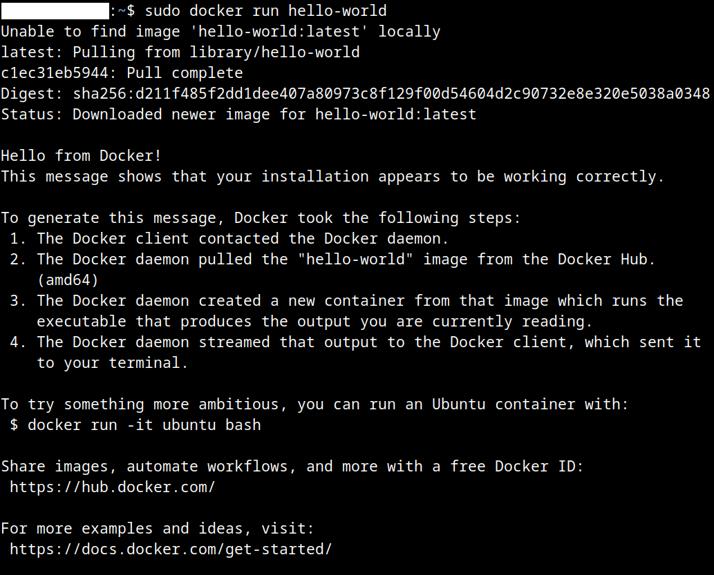

 # Level 1 - Standard Hello World Docker

#1 Installation of Docker

1. Installed docker using "sudo apt install docker.io"

## 2 Running "hello-world" Docker

1. Execution of the command

```
docker run hello-world
```


