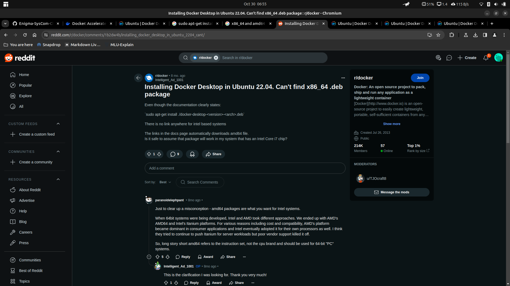

# **Hello, Docker!**

This is my first time using anything related to Docker (as far as I know). So here lie the hardships I underwent to successfully execute the standard *hello-world* in Docker on Ubuntu.

## Attempt to Install Docker Desktop on Ubuntu

- A Google search led me to the official Docker website, and from there I was led to: https://docs.docker.com/desktop/install/linux/ubuntu/.

- I was able to successfully download the Docker package repository, but was unable to go to the next step.

## Enter, Docker Engine

- While I was on a search to look for answers, I landed on a Reddit page which directed me to install Docker Engine.  
    (https://www.reddit.com/r/docker/comments/1b2dw4b/installing_docker_desktop_in_ubuntu_2204_cant/)

## Success

- Here's *hello-world* in Docker.

