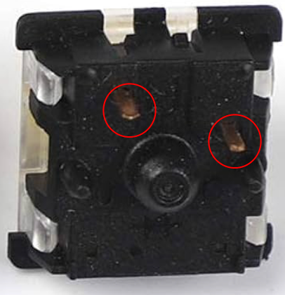
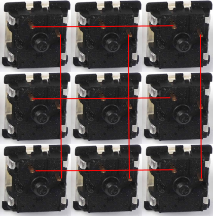
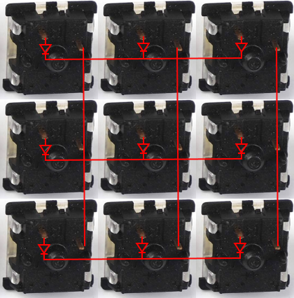

# NotATimeBomb

This is a rookies guide to build a 3x3 macropad

## Prerequisites

| Item                | Quantity        |
|:--------------------|:----------------|
| Braincells          | more the better |
| Cherry MX Switches  | 9               |
| Diodes (100V; 0.2A) | 9               |
| RaspberryPi Pico    | 1               |
| Soldering Iron | 1 |
| Lead wire | 1 roll |

## Getting started

Lets start by understanding how this macropad is going to work in laymans terms
Every cherry MX switch has atleast 2 such contacts connect each of them to a GPIO pin and program it to send a key press when the switch is clicked and it works!! Now we have to do the same 9 switches, simple right ? Yes, but you have limited number of GPIO pins on a micro controller, it might work for now but when you want to do the same for a 4x4 or 3x4 board you wont have enough GPIO pins

so we use a grid system as shown below now all switches are connected and we need only 6 pins compared to 18 before and when a button is pressed the row and column number is sent and the controller knows what keypress to trigger. 

Thats it? no, you need to add diode to prevent ghosting when more than one key is pressed at a time. Diodes prevents incorrect key presses. Diodes ensure that current flows in only one direction, allowing the microcontroller to accurately identify which keys are activated without interference from others.

I am leaving a STL file for the top plate of the macropad in the stl directory. I havent designed the bottom enclosure yet.

make sure to check the polarity of the diode before soldering the small black/grey stripe should be facing away from the pin on the switch. 

Now that we know what to solder where lets soldering. Once the soldering is done, connect a wire from each row and each column to one gpio pin. Now that everything is soldered lets flash our pico with circuit python. <a href="https://learn.adafruit.com/getting-started-with-raspberry-pi-pico-circuitpython/circuitpython">How to flash circuit python on pico?</a>

Once that is done install thonny rename test.py to code.py and drop it in the CIRCUITPY disk that shows on your computer. Change the pin numbers according to your configuration and run the code. When you press each switch the led should blink once. If it doesnt you should go back and check your connections.

Once you verify all the connections it is time to load the keyboard firmware. We will be using kmk firmware because it is simple and easier to modify. 
1. Clone <a href="https://github.com/KMKfw/kmk_firmware"> https://github.com/KMKfw/kmk_firmware </a> 
2. Move the kmk folder to the CIRCUITPY drive and move the code.py to the root of CIRCUITPY drive and modify according to your configuration and run it.

Now we need to prevent mounting the CIRCUITPY drive everytime, this can be done by triggering the pico to disabe mounting the drive until and unless a specific switch on the macropad is pressed during boot. (Yes the same switch can be assigned a macro after boot) to do the place boot.py in the root of CIRCUITPY drive and modify the gpio pin accordingly. 
